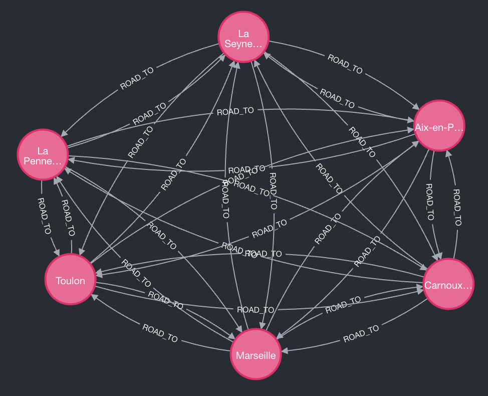

# Holiday Itinerary

## Dependencies

1. [Make](https://www.gnu.org/software/make/)
2. [Poetry (version 2.2.1) ()](https://python-poetry.org/) -- python -m pip
   install poetry==2.2.1

### Poetry

Run environment with `eval $(poetry env activate)`

### Development

1. [Pre-commit](https://pre-commit.com/) -- python -m pip install pre-commit==4.2.0

#### Pre-commit

Install the pre-commit with `python -m pip install pre-commit && pre-commit install`.

#### Tests

To run the tests, simply run `make tests` or run the commands, which are
defined under the `tests` command in the Makefile.

#### Github Actions

There is a GitHub Actions workflow file located at
`.github/workflows/development.yaml` for the development of the application.
This workflow runs pre-commit checks and tests whenever code is pushed to
the `master` branch or when a pull request targeting `master` is opened.

---

## Underlying Data Structure

The system uses a graph database to represent cities, roads, and points of interest.

### 1. Cities and Roads

*Representation of City nodes and ROAD_TO relationships. Reproduce with:*
```
match(c1:City {name: "Marseille"})-[r2:ROAD_TO]->(c2:City) limit 5
return c1, c2
```


Since no suitable road dataset was readily available, a road network was simulated to enable routing between cities.
detailed description in [cities_roads_dataset.md](cities_roads_dataset.md)

- **City Nodes:** Represent 627 French cities with properties like name, population, and geographical coordinates (stored as Neo4j `Point`).
- **ROAD_TO Relationships:** A simulated road network connects cities.
    - **KNN:** Each city is connected to its 5 nearest neighbors.
    - **Connectivity:** The graph is ensured to be a single connected component using Weakly Connected Components (WCC) analysis, with manual bridges added where necessary.

### 2. Points of Interest (POI) and Types

*Representation of City, Pois and Types with IS_A relationships. Reproduce with:*
```
match(c:City {name: "Lyon"})
match(p:Poi) - [IS_IN] -(c) limit 5
match(q:Poi) - [IS_NEARBY] -(c) limit 5
MATCH (p)-[:IS_A]->(t1:Type)
MATCH (q)-[:IS_A]->(t2:Type)
return c,p,q,t1,t2
```


- **POI Nodes:** Tourist attractions, hotels, and restaurants imported from DATAtourisme.fr.
- **Type Nodes:** Instead of using multiple labels on POI nodes, we use a "Super-Node Pattern."
- **IS_A Relationship:** Connects a `POI` to one or more `Type` nodes. This approach offers flexibility for overlapping categories and future hierarchical expansions.

### 3. Spatial Relationships
- **IS_IN:** Connects a `POI` directly to a `City` if the location matches exactly.
- **IS_NEARBY:** For POIs outside city limits, this links the POI to the nearest city within a 100km radius, storing the `distance_km`.

---

## Data Import Pipeline

The project supports both automated and manual data ingestion.

### Automated ETL (Airflow & FastAPI)
detailed description in [data_import.md](data_import.md)
An Apache Airflow DAG (`download-trigger`) orchestrates the ETL process via FastAPI endpoints:
1.  **Download:** Fetches the latest ZIP archive from DATAtourisme.fr.
2.  **Unzip:** Extracts the raw JSON data.
3.  **Extract:** Processes JSON files and generates Neo4j-compatible CSVs (`poi_nodes.csv`, `type_nodes.csv`, etc.).
4.  **Import:** Loads CSVs into Neo4j using `LOAD CSV` and establishes spatial relationships.
5.  **Cleanup:** Removes temporary files and old data versions.

### Manual Data Import
dataset from datatourisme.fr can be downloaded here: [dataset](https://diffuseur.datatourisme.fr/webservice/b2ea75c3cd910637ff11634adec636ef/2644ca0a-e70f-44d5-90a5-3785f610c4b5)
Latest dataset download here: [latest dataset](https://diffuseur.datatourisme.fr/flux/24943/download/complete)

The .zip archive is around 1 GB large and unzipped around 8 GB

__make_dataset.py__ script takes the directory and converts it to three CSV files that can be directly imported by neo4j.
File `poi_nodes.csv` contains information about the POI except for the types field. Types is a list of roughly 350 unique type descriptions.
Therefore the types are mapped via so called __Super-Node Pattern__ where for every type a node is created and every POI node gets a relationship to it.
File `type_nodes.csv` and `poi_is_a_type_rels.csv` contain that information.

| row_name               | description                         | example                                |
| ---------------------- | ----------------------------------- | -------------------------------------- |
| id                     | integer - UUID from datatourisme.fr | 6-ffcd03f5-35d6-305d-95c7-e867e1453e98 |
| label                  | name of the POI                     |                                        |
| comment                | short description                   |                                        |
| description            | long description                    |                                        |
| types                  | list of POI types                   | Restaurant, BarOrPub                   |
| homepage               | homepage                            |                                        |
| city                   | address part                        |                                        |
| postal_code            | address part                        |                                        |
| street                 | address part                        |                                        |
| lat                    | latitude                            |                                        |
| long                   | longitude                           |                                        |
| additional_information | some additional info                |                                        |

If you need to import data manually using `neo4j-admin`:
1.  download and extract new feed data into __example_data__ create dataset with `make_dataset.py`
2.  **Stop Neo4j:** `docker compose down`
3. If the `docker compose up` command wasn't yet executed and thus no volume has been created, we have to create it:
```shell
docker volume create neo4j_data
```
3.  **Import Command:** from the root directory
    ```bash
    docker run --rm \
        --volume=$PWD/example_data:/import \
        --volume=$(docker volume inspect -f '{{.Mountpoint}}' neo4j_data):/data \
        neo4j:2025.10.1 \
        neo4j-admin database import full --overwrite-destination \
            --multiline-fields=true \
            --nodes="POI=/import/poi_nodes.zip" \
            --nodes="Type=/import/type_nodes.zip" \
            --relationships="IS_A=/import/poi_is_a_type_rels.zip"\
            --nodes="City=/import/cities_nodes.zip" \
            --relationships="ROAD_TO=/import/roads_rels.zip"
    ```
4. Create `IS_IN` relationships
   ```
   CALL apoc.periodic.iterate(
      "MATCH (p:Poi {importVersion: $import_version}) WHERE p.city IS NOT NULL RETURN p",
      "MATCH (c:City {name: p.city})
       MERGE (p)-[r:IS_IN]->(c)
       SET r.importVersion = $import_version",
      {
        batchSize: 2000,
        parallel: true,
        params: { import_version: $import_version }
      }
    )
    YIELD batches, total, errorMessages, committedOperations
    RETURN batches, total, errorMessages, committedOperations;
   ```
5. create `IS_NEARBY` relationships
   ```
   CALL apoc.periodic.iterate(
          "MATCH (p:Poi {importVersion: $import_version}) 
           WHERE NOT (p)-[:IS_IN]->(:City) AND p.location IS NOT NULL
           RETURN p",
          "MATCH (c:City)
           WHERE point.distance(p.location, c.location) < 100000
           WITH p, c, point.distance(p.location, c.location) AS dist
           ORDER BY dist ASC
           WITH p, collect(c)[0] AS nearestCity, collect(dist)[0] AS shortestDist
           WHERE nearestCity IS NOT NULL
           MERGE (p)-[r:IS_NEARBY]->(nearestCity)
           SET r.import_version = $import_version,
               r.distance_km = round(shortestDist/1000.0, 2)",
          {
            batchSize: 1000,
            parallel: false,
            params: { import_version: $import_version }
          }
        )
        YIELD batches, total, errorMessages, committedOperations
        RETURN batches, total, errorMessages, committedOperations;
   ```
---

Starting the DB with docker-compose uses the `EXTENSION_SCRIPT` ENV which runs `import_script.sh` from `init` directory.
This makes initial data import automatically done once.
The only manual work needed at this moment is to create `gds` projections needed for some API requests:

```cypher
CALL gds.graph.exists('city-road-graph') YIELD exists
WITH exists
WHERE NOT exists

CALL gds.graph.project(
  'city-road-graph',
  'City',
  {
    ROAD_TO: {
      orientation: 'UNDIRECTED',
      properties: 'km'
    }
  }
)
YIELD graphName, nodeCount, relationshipCount
RETURN graphName, nodeCount, relationshipCount;
```

## Start neo4j

File __docker_compose.yml__ contains everything to start Neo4j locally with

```shell
docker-compose up -d
```

Note: in docker-compose the _NEO4J_server_directories_import_ ENV is set to __example_data__ which means only csv files from this directory may be imported to Neo4j.

## Test your neo4j

After executing `docker compose up -d` command go to `localhost:7474` and connect to the database (no auth required).
Try some of these requests:

get all types:\
`match(t:Type) return t.typeId as type`

count of POI in Paris:\
`match (p:POI {city: "Paris"}) return count(p)`

get distribution of POI types in Lyon:

```
 match (p:POI {city: "Lyon"}) - [r:IS_A] -> (t:Type)
 with t, count(*) as cnt
 return t.typeId, cnt order by cnt desc
```

get restaurants in Avignon:\
`MATCH (p:POI {city: "Avignon"})-[r:IS_A]->(t:Type {typeId: "Restaurant"}) return p`

______________________________________________________________________


## Neo4j Driver

To access the database with Python code, you need to initialize the
`Neo4jDriver` class, located in the module `src/neo4j_driver`. You can
configure the driver using the following environment variables:

- **NEO4J_URI** — Sets the URI of the database. Default: `bolt://neo4j:7687`.
- **NEO4J_USER** — Sets the username to access the database. Default: `neo4j`.
- **NEO4J_PASSPHRASE** — Sets the passphrase to access the database. Default:
  no passphrase.

## Neo4j API

To access the driver via the `Neo4jApi`, the following endpoints are defined:

- **/poi** -- Takes `poi_id: str` as a parameter and returns a JSON dict
  with all information about the POI, e.g. `{"id":"...", "label":"...", ...}`.
- **/poi/nearby** -- Takes `poi_id: str` and `radius: int` as parameters
  and returns a JSON dict with all POIs located within the radius around the
  given POI, e.g. `{"nearby": [ ... ]}`.
- **/distance** -- Takes `poi1_id: str` and `poi2_id: str` as parameters
  and returns a JSON dict with the distance, e.g. `{"distance": 234.12}`.
- **/tsp/shortest-round-tour** -- Takes a list of `poi_ids: list[str]` as
  a parameter and returns a JSON dict with the optimized POI order,
  e.g. `{"poi_order": [ ... ]}`.
- **/tsp/shortest-path-no-return** -- Takes a list of `poi_ids: list[str]`
  as a parameter and returns a JSON dict with the optimized POI order,
  e.g. `{"poi_order": [ ... ]}`.
- **/tsp/shortest-path-fixed-dest** -- Takes a list of `poi_ids: list[str]`
  and `dest: str` as parameters and returns a JSON dict with the optimized
  POI order ending at the fixed destination, e.g. `{"poi_order": [ ... ]}`.
- **/dijkstra** -- Takes a list of `poi_ids: list[str]` as a parameter
  and returns a JSON dict with the POI order along the shortest path,
  e.g. `{"poi_order": [ ... ]}`.

## Project Organization

```
├── LICENSE
├── README.md          <- The top-level README for developers using this project.
├── data
│   ├── external       <- Data from third party sources.
│   ├── interim        <- Intermediate data that has been transformed.
│   ├── processed      <- The final, canonical data sets for modeling.
│   └── raw            <- The original, immutable data dump.
│
├── logs               <- Logs from training and predicting
│
├── models             <- Trained and serialized models, model predictions, or model summaries
│
├── notebooks          <- Jupyter notebooks. Naming convention is a number (for ordering),
│                         the creator's initials, and a short `-` delimited description, e.g.
│                         `1.0-jqp-initial-data-exploration`.
│
├── references         <- Data dictionaries, manuals, and all other explanatory materials.
│
├── reports            <- Generated analysis as HTML, PDF, LaTeX, etc.
│   └── figures        <- Generated graphics and figures to be used in reporting
│
├── requirements.txt   <- The requirements file for reproducing the analysis environment, e.g.
│                         generated with `pip freeze > requirements.txt`
│
├── src                <- Source code for use in this project.
│   ├── __init__.py    <- Makes src a Python module
│   │
│   ├── data           <- Scripts to download or generate data
│   │   └── make_dataset.py
│   │
│   ├── features       <- Scripts to turn raw data into features for modeling
│   │   └── build_features.py
│   │
│   ├── models         <- Scripts to train models and then use trained models to make
│   │   │                 predictions
│   │   ├── predict_model.py
│   │   └── train_model.py
│   │
│   ├── visualization  <- Scripts to create exploratory and results oriented visualizations
│   │   └── visualize.py
│   └── config         <- Describe the parameters used in train_model.py and predict_model.py
```

______________________________________________________________________

<p><small>Project based on the <a target="_blank" href="https://drivendata.github.io/cookiecutter-data-science/">cookiecutter data science project template</a>. #cookiecutterdatascience</small></p>
