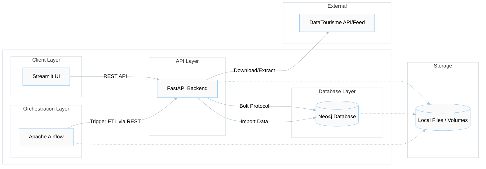
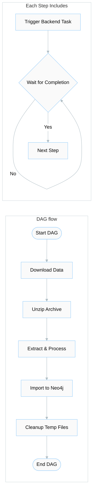

### Project Architecture

The following diagram illustrates the overall architecture of the project, including the data flow and the relationships between the different services.

### Components Description

- **Streamlit UI**: Provides a user-friendly interface for holiday itinerary planning. It consumes data and services provided by the FastAPI Backend.
- **FastAPI Backend**: Acts as the central hub of the application. It handles business logic, provides RESTful endpoints for the UI, and manages ETL processes.
- **Neo4j Database**: Stores the graph data, including Points of Interest (POIs), Cities, and their relationships (IS_IN, ROAD_TO, etc.).
- **Apache Airflow**: Orchestrates the data ingestion and processing pipeline. It periodically triggers the Backend to download and import new data from DataTourisme.
- **DataTourisme**: The external data source providing tourism-related information.
### Data Upload Process

The following flow chart describes the orchestrated data upload process managed by Airflow.

